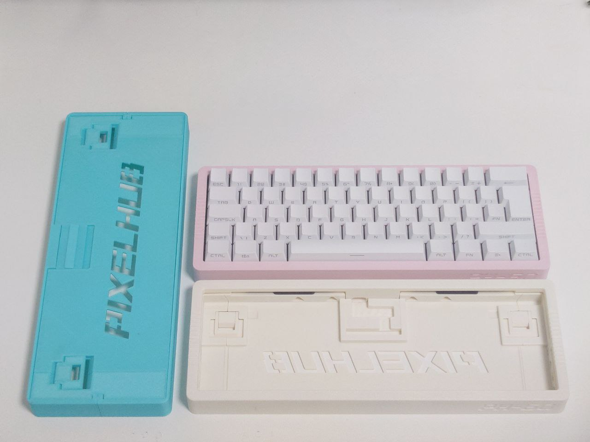
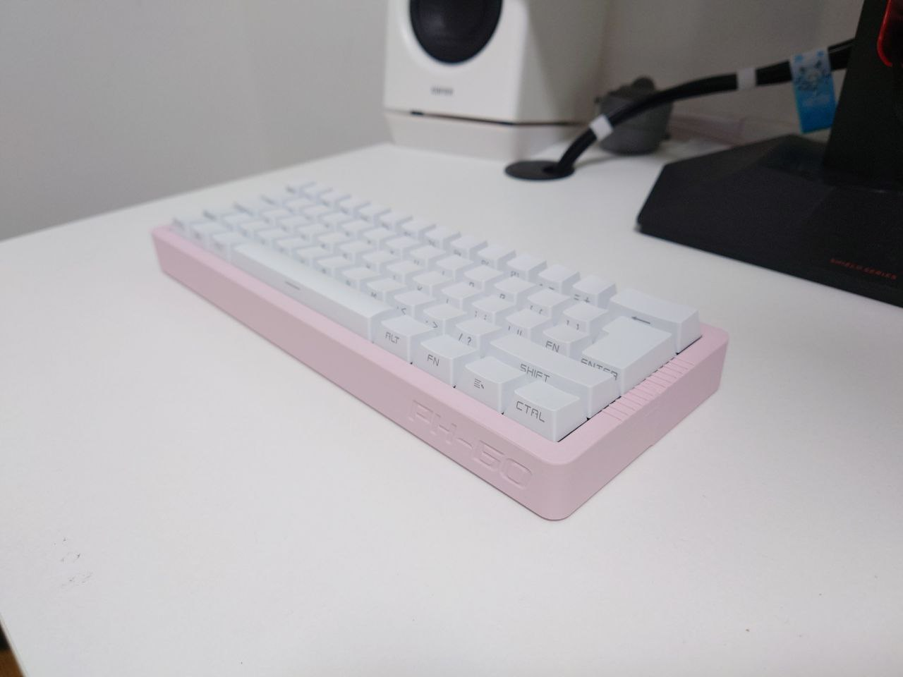

[English Version](https://github.com/ph-design/PH60/blob/Rev.1/README.md) | 中文

---

# PH60 Rev.1





这是一个 ISO 60% 布局的机械键盘，基于ISO/IEC 9995标准。

在哔哩哔哩观看详细介绍!

哔哩哔哩: https://www.bilibili.com/video/BV19Txce7E6C/


## 项目结构
```
PH60
├── LICENSE                         # 项目许可证文件
├── PCB_Daughterboard_Model         # 子板3D模型文件
├── PCB_Daughterboard_Rev_SuperEZ   # 子板PCB设计文件
├── PCB_Model_Rev1                  # 主板3D模型文件
├── PCB_Rev1                        # 主板PCB设计文件
├── Preview                         # 键盘预览图
├── Production                      # 生产文件
├── README-zh_CN.md                 # 中文说明文档
├── README.md                       # 英文说明文档
└── case_model                      # 键盘外壳3D模型文件
```

子板来源于[UDB-S](github.com/Unified-Daughterboard/UDB-S)，为了减少体积及验证成本去除了ESD防护等功能，如果你对电气性能有更高要求可参考原项目进行修改。

## 规格

1. 3D打印外壳，适用于任何打印尺寸超过250mm x 250mm的3D打印机。
2. Gasket垫片结构，打字体验更柔和灵活。
3. 搭载 [Raspberry Pi RP2040](https://www.raspberrypi.com/products/rp2040/) 微控制器。
4. 支持开源 [QMK 固件](https://qmk.fm/) 和 [VIA 配置](https://www.caniusevia.com/)（通过JSON文件配置）。
5. 可选用于自由放置C口位置的小板。

## 组装步骤

1. 打印所有零件，定位板需要分两部分打印。也可以使用 FR-4 或其他材料制作。
2. 对齐上盖的两条轨道，用力按压，直到表面齐平。
3. 底壳两侧同样方法安装。
4. 在板子两侧边缘贴上 Poron 泡棉。
5. 把子板放入中央的夹具中并固定好。打开 Molex 连接器盖子，插入 FFC 线缆，然后合上盖子（可选）。
6. 在板子边角和中心插入几个轴体，把定位板翻过来，把PCB牢牢按在定位板上。确保轴体针脚正确插入热插拔插座，避免弯曲。
7. 安装所有平衡杆，初步测试PCB。
8. 安装剩下的所有轴体。
9. 将 FFC 电缆连接到 PCB 上。
10. 把定位板和 PCB 放入底壳，先将上盖前沿挂入底壳面向用户侧的凹槽，然后按下上盖另一边，直到和底壳齐平。
11. 锁定夹具。
12. 安装键帽。

## 注意事项

如果你是手工焊接PCB，避免使用Sn42Bi58低温焊锡膏。否则在高强度使用下，可能会导致PCB和热插拔插座之间虚焊。