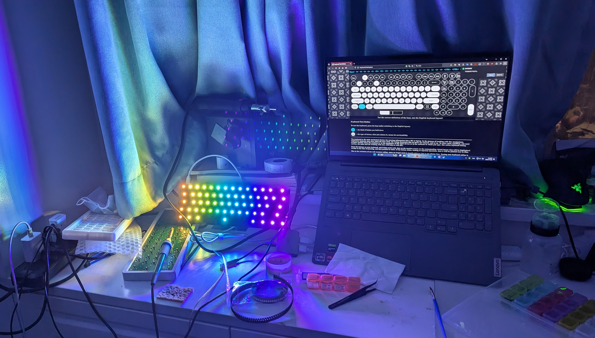
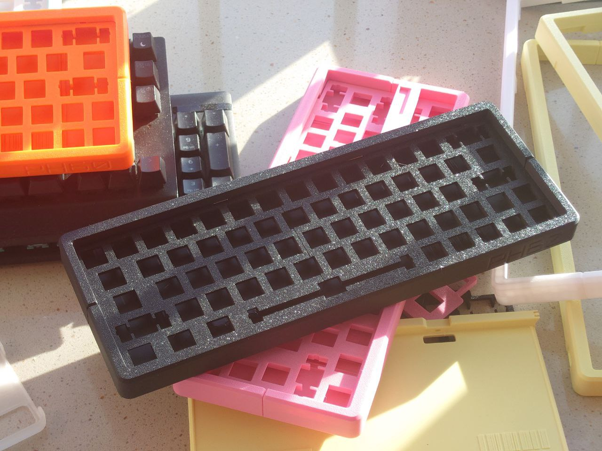

[English Version](https://github.com/ph-design/PH60/blob/Rev.2/README.md) | 中文

---

# PH60 Rev.2
这是一个 ISO 60% 布局的机械键盘，基于ISO/IEC 9995标准。

在哔哩哔哩观看详细介绍!

哔哩哔哩: https://www.bilibili.com/video/BV19Txce7E6C/

我们进行了一次全新的升级！现在已迭代到Rev.2


## 相比Rev.1的更新
### PCB
我们在按照自己的想法去定制这块键盘，同时也参考了其他用户的意见。
- 我们添加了更为主流的ANSI配列，现在大多数人应该会感到熟悉。

- PCB由4层板减少到了2层板，电气性能理论下降，但对于键盘来说足够了，但是成本大大减少了。

- 为ANSI和ISO配列添加了RGB矩阵灯的支持。

- 暂时去除了MOLEX连接器和子母板的设计，因为它们不够稳定。



- <b>全新的多配列兼容PCB</b>。兼容ANSI/ISO/WK/WKL/HHKB，匠心布线。这块PCB由团队的 [nonameC_](http://www.github.com/nonameCCC) 倾心打造。

### 外壳




Rev2版本在保持可打印性的同时，引入了创新设计，提升了用户体验。

- 磁铁固定上盖，保留卡扣设计

- 创新的"枕头"脚撑设计，可调节7度和0度输入角度

- Gasket结构设计，配套特制加厚定位板

- 完全兼容GH60标准PCB

- 针对不同打印机和材料优化的打印参数
  
新版本介绍: https://www.bilibili.com/video/BV1fsB8YQELg/


## 设计理念

PH60 Rev2旨在解决消费级3D打印机无法打印完整键盘外壳的问题。我们通过模块化设计和创新连接方式，实现了高质量、可定制的键盘外壳。

## 使用指南

1. 从GitHub仓库下载模型文件
2. 根据您的打印机选择合适的切片参数（Bambu Lab用户可在MakerWorld获取优化配置）
3. 打印各个部件
4. 按照[组装步骤](#组装步骤)完成键盘组装

---
## 项目结构
```
PH60 Rev.2
├── Case_Model_Rev2                 # 键盘外壳3D模型文件
├── LICENSE                         # 项目许可证文件
├── PCB_Model_Rev2                  # 主板3D模型文件
├── PCB_Rev2                        # 主板PCB设计文件
├── Plate                           # 定位板文件
├── Preview                         # 键盘预览图
├── Production                      # 生产文件
├── README-zh_CN.md                 # 中文说明文档
└── README.md                       # 英文说明文档
```

## 规格

1. 3D打印外壳，适用于任何打印尺寸超过250mm x 250mm的3D打印机。
2. Gasket垫片结构，打字体验更柔和灵活。
3. 搭载 [Raspberry Pi RP2040](https://www.raspberrypi.com/products/rp2040/) 微控制器。
4. 支持开源 [QMK 固件](https://qmk.fm/) 和 [VIA 配置](https://www.caniusevia.com/)（通过JSON文件配置）。


## 组装步骤

1. 对齐中央底壳和两个侧壳的内部标记，确保文字方向一致。将侧壳压入中央底壳。

2. 类似地，组装两个顶盖部件。组装后，顶盖应完美对齐。如有必要，可使用橡皮锤。

3. 确保磁铁极性一致，然后将磁铁压入底壳、顶盖和枕垫的所有指定孔中。如需要，可使用胶水。

4. 首先将左侧卡扣固定到位，然后释放盖子，使右侧由磁铁固定。

5. 翻转壳体，将硅胶防滑垫固定在壳体和枕垫上。
   
6. 安装PCB

更详细的打印和安装步骤，请参考[MakerWorld](https://makerworld.com.cn/zh/models/661895).

## 注意事项

如果你是手工焊接PCB，避免使用Sn42Bi58低温焊锡膏。否则在高强度使用下，可能会导致PCB和热插拔插座之间虚焊。