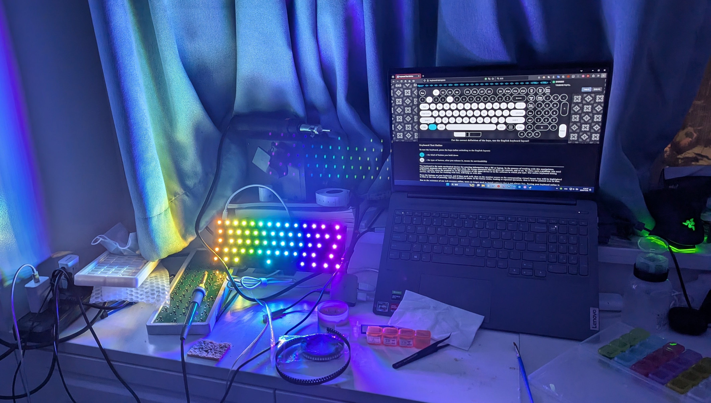
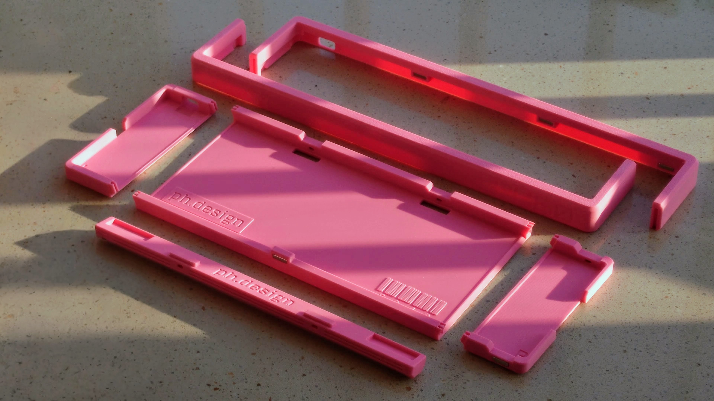
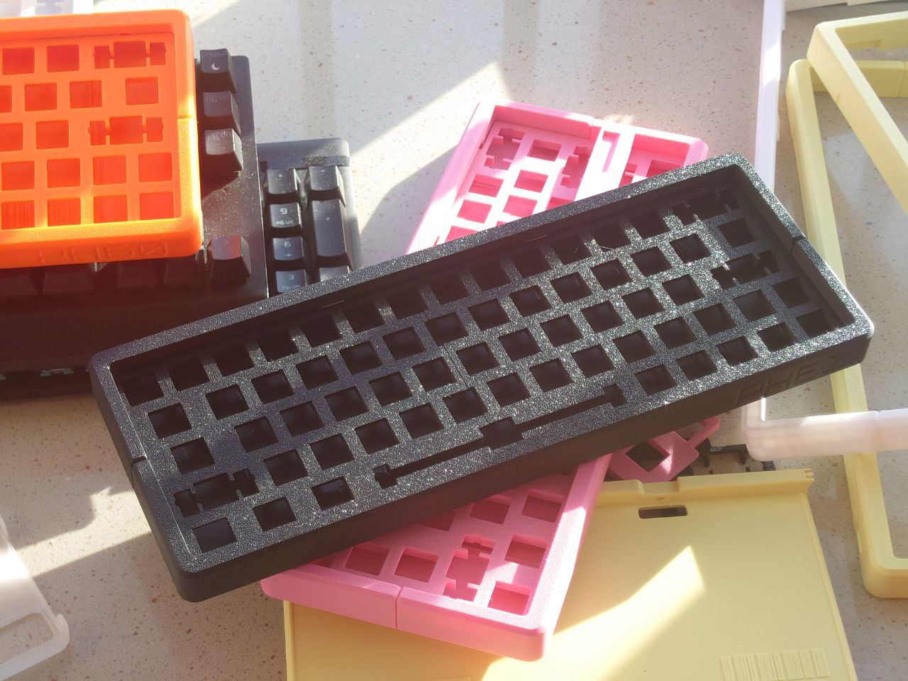

English Version | [中文版](https://github.com/ph-design/PH60/blob/Rev.2/README.md)

---

# PH60 Rev.2
This is a mechanical keyboard with an ISO 60% layout, based on the ISO/IEC 9995 standard.

Watch the detailed introduction on Bilibili!

Bilibili: https://www.bilibili.com/video/BV19Txce7E6C/

We've made a brand new upgrade! Now we've iterated to Rev.2


## What's new compared to Rev.1
### PCB
We customized this keyboard according to our own ideas while also considering other users' opinions.
- Added the more mainstream ANSI layout, which most people should now feel familiar.

- The PCB has been reduced from 4 layers to 2 layers. Theoretically, the electrical performance has decreased, but it's sufficient for a keyboard, and the cost has been greatly reduced.

- Added support for RGB matrix lighting for both ANSI and ISO layouts.

- Temporarily removed the MOLEX connector and daughter board design as they were not stable enough.



- <b>Brand new multi-layout compatible PCB</b>. Compatible with ANSI/ISO/WK/WKL/HHKB, with meticulous routing. This PCB was carefully crafted by our team member [nonameC_](http://www.github.com/nonameCCC).

### Case




Rev2 version introduces innovative designs while maintaining printability, enhancing user experience.

- Magnetic top cover fixation, retaining the snap-fit design

- Innovative "pillow" foot support design, adjustable 7-degree and 0-degree input angles

- Gasket structure design, with specially made thickened positioning plate

- Fully compatible with GH60 standard PCB

- Optimized printing parameters for different printers and materials
  
New version introduction: https://www.bilibili.com/video/BV1fsB8YQELg/


## Design Philosophy

PH60 Rev2 aims to solve the problem of consumer-grade 3D printers being unable to print complete keyboard cases. Through modular design and innovative connection methods, we've achieved high-quality, customizable keyboard cases.

## Usage Guide

1. Download model files from the GitHub repository
2. Choose appropriate slicing parameters based on your printer (Bambu Lab users can get optimized configurations on MakerWorld)
3. Print each component
4. Complete keyboard assembly following the [Assembly Steps](#Assembly-Steps)

---
## Project Structure
```
PH60 Rev.2
├── Case_Model_Rev2                 # Keyboard case 3D model files
├── LICENSE                         # Project license file
├── PCB_Model_Rev2                  # Motherboard 3D model files
├── PCB_Rev2                        # Motherboard PCB design files
├── Plate                           # Positioning plate files
├── Preview                         # Keyboard preview images
├── Production                      # Production files
├── README-zh_CN.md                 # Chinese README
└── README.md                       # English README
```

## Specifications

1. 3D printed case, suitable for any 3D printer with a print size over 250mm x 250mm.
2. Gasket structure for a softer and more flexible typing experience.
3. Equipped with [Raspberry Pi RP2040](https://www.raspberrypi.com/products/rp2040/) microcontroller.
4. Supports open-source [QMK firmware](https://qmk.fm/) and [VIA configuration](https://www.caniusevia.com/) (configured via JSON file).


## Assembly Steps

1. Align the internal markers of the central bottom case and two side cases, ensuring the text direction is consistent. Press the side cases into the central bottom case.

2. Similarly, assemble the two top cover components. After assembly, the top cover should align perfectly. Use a rubber mallet if necessary.

3. Ensure consistent magnet polarity, then press magnets into all designated holes in the bottom case, top cover, and pillow. Use glue if needed.

4. First secure the left snap-fit, then release the cover, allowing the right side to be secured by magnets.

5. Flip the case and secure silicone anti-slip pads to the case and pillow.
   
6. Install the PCB

For more detailed printing and installation steps, please refer to [MakerWorld](https://makerworld.com/zh/models/808113).

## Precautions

If you're hand-soldering the PCB, avoid using Sn42Bi58 low-temperature solder paste. Otherwise, under high-intensity use, it may lead to false soldering between the PCB and hot-swap sockets.