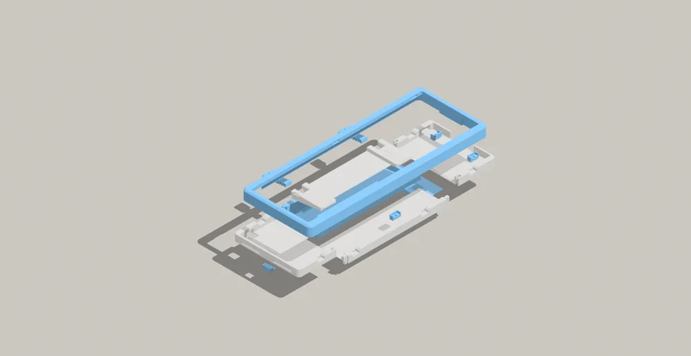
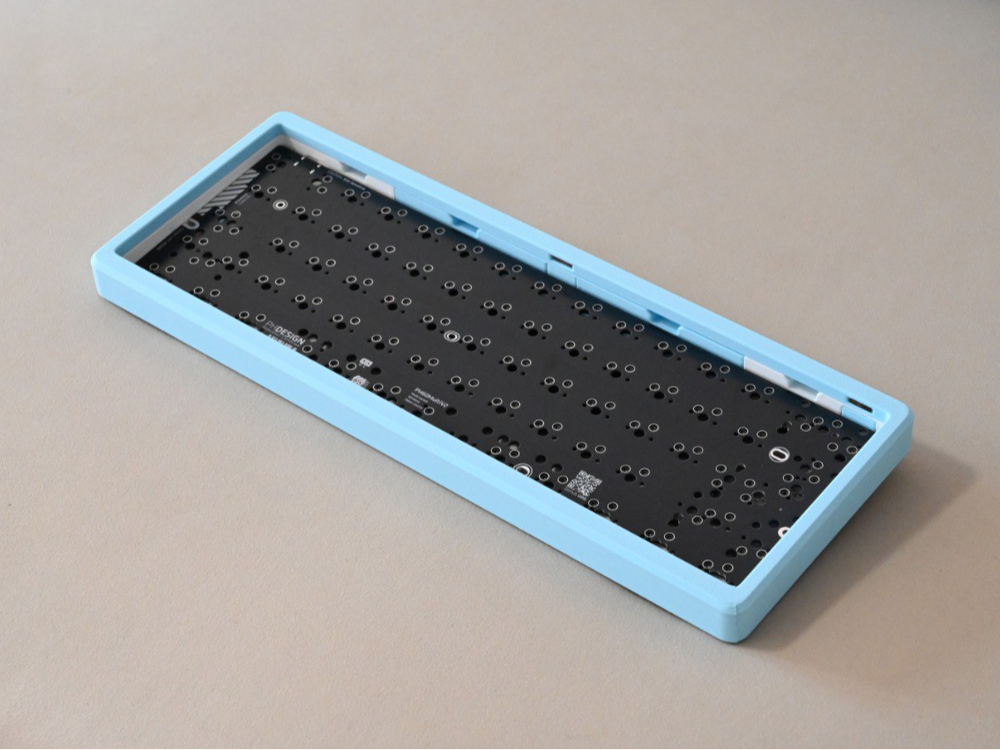
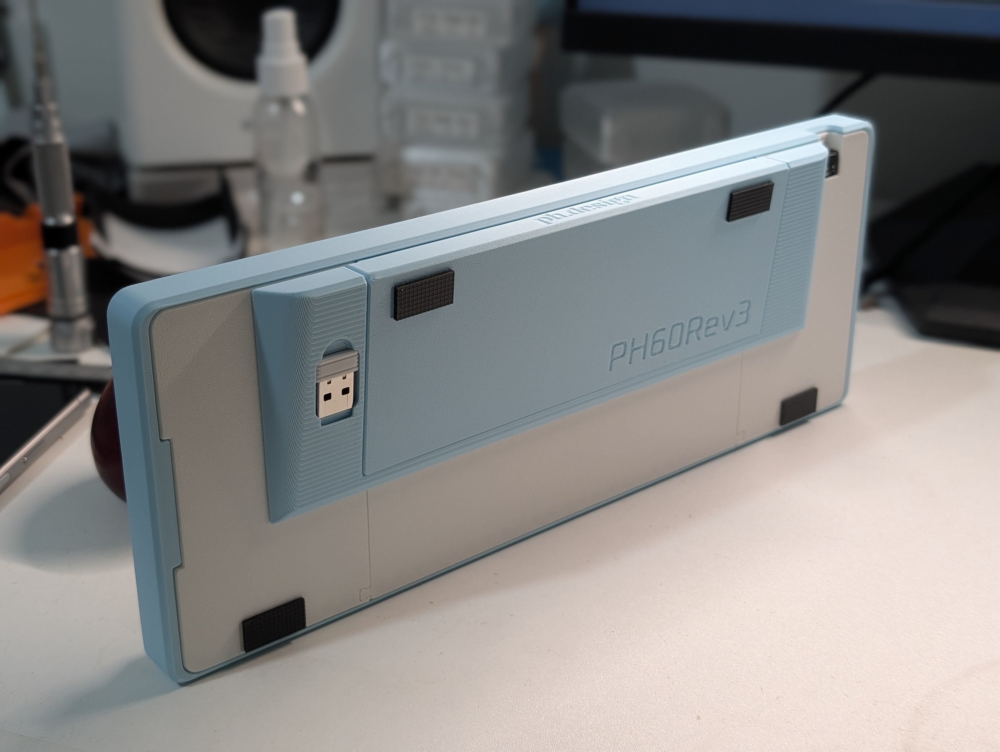

English Version | [中文版](README-zh_CN.md)

**[GitHub Repo](https://github.com/ph-design/PH60) | [Wiki](https://wiki.phdesign.cc/PH60/rev3_multi/) | [Discord](https://discord.gg/8UfQXcefPH) | [Taobao Store](https://shop268559013.taobao.com) | [QQ Group](https://qm.qq.com/q/OY0mIxSRs4) | [Customizer](https://custom.phdesign.cc)**

---

# PH60 Rev.3

**PH60 Rev.3** is a 60% tri-mode mechanical keyboard kit with an FDM 3D-printable case and the PH60 Rev.3 Multi PCB. This revision switches to the NRF52840 MCU with Bluetooth 5.3 and Nordic 2.4 GHz proprietary protocol (TBD), runs [ZMKs](https://github.com/ph-design/zmks) firmware (our fork of ZMK), and redesigns the case for wireless use and multi-layout compatibility.








## Features

### PCB

+ [Nordic NRF52840](https://www.nordicsemi.com/products/nrf52840) MCU, Bluetooth 5.3 + 2.4 GHz (TBD).
+ [ZMKs](https://github.com/ph-design/zmks) firmware with [ZMKs Studio](https://zmks.phdesign.cc/) for real-time keymap editing.
+ Multi-layout support — ANSI / ISO / WK / WKL / HHKB, plus split spacebar: 6.25u → 2.75u + 1u + 2.5u, 7u → 3u + 1u + 3u.
+ Battery powered, built-in battery connector.

> **Note on ANSI/ISO variants:** Rev.3 currently only ships the **Multi** layout PCB. The ANSI PCB in this repo is an early prototype with a fundamentally different design approach — there is no standalone ISO version. We may develop dedicated ANSI/ISO variants based on ZMKs in the future.

### Case

+ Designed for FDM 3D printing — printable on any printer with a bed ≥ 256 × 256 mm, no supports required.
+ Magnetic quick-release latches — tool-free disassembly.
+ O-ring gasket plate mount — firm, crisp feel without foam.
+ Modular battery tray and magnet drawers, fits up to 100 × 50 × 5 mm LiPo and 10 × 5 × 5 mm magnets.
+ Locking holder for wireless receivers, compatible with most commercial 2.4 GHz receiver housings.
+ Multiple outer case variants: Standard, WKL, HHKB (6u/7u), and split backspace options.

### Plates

+ Plates available for ANSI, ISO, WK, HHKB (6u/7u), LS64, EC60, and split-key variants.
+ More layouts added over time.

## What's new compared to Rev.2

| | Rev.2 | Rev.3 |
| --- | --- | --- |
| **MCU** | RP2040 | NRF52840 |
| **Connectivity** | USB only | USB + Bluetooth 5.3 + 2.4 GHz (TBD) |
| **Firmware** | QMK + VIA | ZMKs + ZMKs Studio |
| **Power** | USB powered | Battery powered |
| **Split spacebar** | Not supported | 6.25u & 7u split |
| **Case** | 3-piece modular | Magnetic quick-release, O-ring gasket |

## Customizer

Configure your PH60 Rev.3 with live 3D preview at [custom.phdesign.cc](https://custom.phdesign.cc).


---

## Project Structure

```
PH60 Rev.3
├── Assets/                         # Preview images
├── Case_Model_Rev3/                # Case 3D model files (STEP)
├── LICENSE
├── PCB_Model_Rev3/                 # PCB 3D model files
├── PCB_Rev3/
│   ├── ANSI/                       # ANSI variant (early prototype)
│   └── Multi/                      # Multi-layout variant (primary)
├── Plates_Rev3/                    # Plate files (STEP)
├── Production/
│   ├── PH60-Rev3-ANSI/             # ANSI production files
│   └── PH60-Rev3-Multi/            # Multi production files
├── README.md
└── README-zh_CN.md
```

## Printing Guide

The case prints well with default FDM settings. Recommended parameters for best results:

| Setting | Recommended | Notes |
| --- | --- | --- |
| Filament | PLA or PETG | High-temp materials increase warp risk |
| Layer height | 0.2 mm | Model designed around 0.2 mm |
| Wall count | 2 walls | — |
| Infill pattern | Gyroid | — |
| Infill density | 15% | — |
| Wall generator | Arachne | Improves print speed |
| Accurate outer wall | Enabled | Reduces visible layer lines |
| Support | Off | Designed for supportless printing |

Make sure the bed is leveled and clean before printing. Use adhesive on long parts like the top cover to prevent warping. Sand and clean prints for a better finish.

## Assembly

### Bill of Materials

| Item | Qty | Notes |
| --- | --- | --- |
| 3D printed case parts | 1 set | PLA or PETG recommended |
| PH60 Rev.3 Multi PCB | 1 | Pre-soldered SMD components |
| MX-compatible switches | 61+ | Varies by layout |
| Keycaps | 1 set | Compatible with 60% layout |
| LiPo battery (optional) | 1 | Recommended: 100 × 50 × 5 mm, Molex 1.25 mm connector |
| Magnets | 8 | Recommended: 10 × 5 × 3 mm, N52 |
| Silicone O-rings | 8 | OD 9 mm, cord 1.5 mm |
| Silicone anti-slip pads | 4 | Recommended: 20 × 10 × 2 mm |

For detailed assembly steps, refer to the [Wiki](https://wiki.phdesign.cc/PH60/rev3_multi/).

## Firmware

### Getting Firmware

- **GitHub Actions**: Download from the [ZMKs config repository](https://github.com/ph-design/ph_lite-zmk-config) Actions artifacts.
- **QQ Group**: Join [512933670](https://qm.qq.com/q/OY0mIxSRs4) for firmware files in group shared folder.

### Flashing Firmware

1. **Enter bootloader**: Press `FN + B + R`, or remove the spacebar keycap and double-tap the `BOOT` pads with tweezers.
2. **Flash**: The keyboard appears as a USB storage device. Copy the `.uf2` file to it — the keyboard reboots automatically.

### Keymap Customization

Visit [ZMKs Studio](https://zmks.phdesign.cc/) for real-time keymap editing.

## FAQ

**Q: Which 3D printers can print the Rev.3 case?**
A: Any FDM printer with a bed ≥ 256 × 256 mm that can print PLA or PETG.

**Q: Which layouts does the Rev.3 case support?**
A: ANSI, ISO, HHKB, WK, WKL, LS64, and EC60 (NIZ electrostatic capacitive). Plate designs are continuously updated.

**Q: Why is there no dedicated ANSI or ISO PCB?**
A: The early ANSI prototype has a fundamentally different design from the Multi PCB. We focused on Multi to support all layouts with a single board. Dedicated variants may come later based on ZMKs.

**Q: What battery and magnet sizes are supported?**
A: Up to 100 × 50 × 5 mm LiPo battery. Magnets: 10 × 5 × 3 mm (N52 recommended). The battery tray and magnet drawers can be modified for other sizes.

## Getting Help

- GitHub Issues: [ph-design/PH60](https://github.com/ph-design/PH60/issues)
- Discord: [discord.gg/phdesign](https://discord.gg/8UfQXcefPH)
- QQ Group: [512933670](https://qm.qq.com/q/OY0mIxSRs4)
- Wiki: [wiki.phdesign.cc](https://wiki.phdesign.cc/)