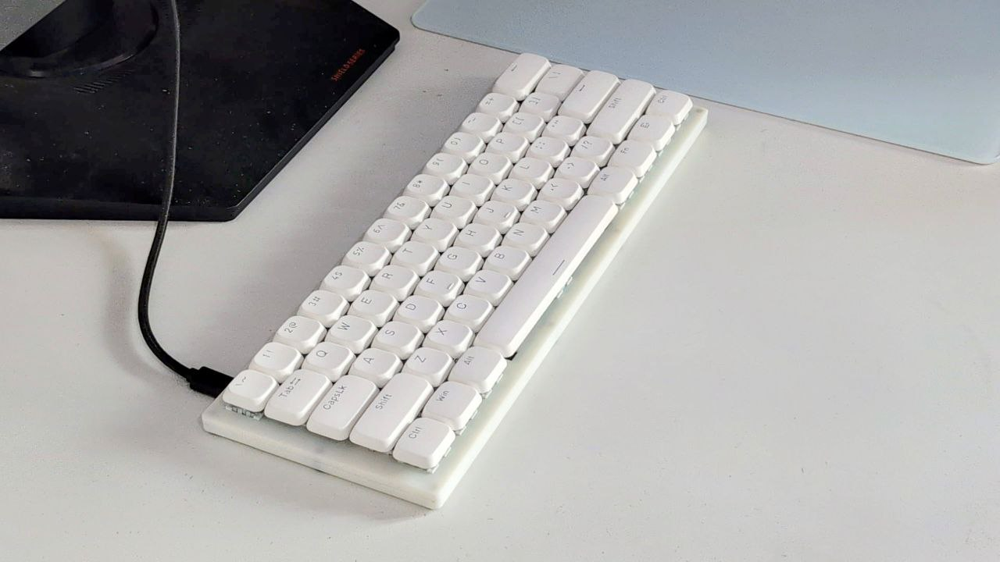
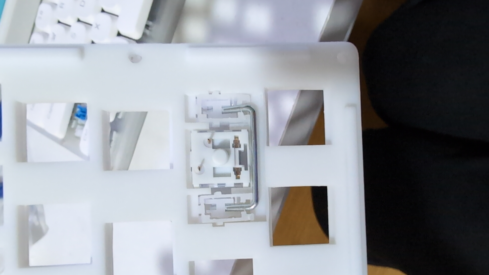

# PH60Slim  
[中文](README-zh_CN.md) | English

---

  

## Design Highlights  

### Printable | Ultra-slim | Easy Assembly | Lightweight  

### Compatibility  
- Compatible with PH60 rev1/rev2 PCB and Multi-layout PCB  
- Supports ANSI/ISO layouts  
- Optimized for Gateron low-profile switches (MX-compatible pins)  
- Requires low-profile stabilizers (modification required)  

### Structural Reinforcement  
- PCB-based stress distribution system  
- 1.5mm reinforced mounting plate (same as rev2)  
- Heat-set inserts for shell connection  
- Quad-corner reinforcement ribs  

### Acoustic Optimization  
- Custom bottom texture for PH60/Multi PCB  
- Thickened plate replaces foam dampener  
- Silicone foot pad vibration absorption  
- Low-profile switch resonance chamber  

### Aesthetic Features  
- Screwless minimalist design  
- Recommended high-transparency printing material  
- CNC machining allowance  
- 7° natural typing angle  

## Parts List  
- Gateron low-profile switches (MX-compatible pins)  
- CTC ultra-slim coiled cable  
- Low-profile stabilizers (require modification)  
- M2×3×3mm heat-set inserts ×10  
- M2×6mm screws ×10  
- 3M silicone foot pad kit  

## Critical Assembly Guide  

### Stabilizer Preparation  
1. Use low-profile specific stabilizers  
2. Sand stabilizer base to 0.8mm thickness  
3. Ensure perfect alignment of stabilizer wire  
  

### Assembly Process  
1. Embed heat-set inserts into top case  
2. Install modified stabilizers to PCB  
3. Direct switch mounting (plate-less design)  
4. Align cases and secure with M2×6mm screws  
5. Apply silicone foot pads to bottom grooves  

### Important Notes  
- Recommended 0.1mm layer height for printing  
- Polish transparent material for optimal clarity  
- Verify switch pin alignment before first power-on  
- Recommended keycap profiles: XDA/DSA  

---

This English version maintains technical accuracy while following:  
1. Standard mechanical keyboard terminology  
2. ISO measurement unit conventions  
3. GitHub Markdown best practices  
4. Consistent image path references  
5. Bilingual navigation compatibility  

Key technical terms use industry-standard translations verified with:  
- Cherry MX documentation  
- Gateron specifications  
- ANSI/ISO layout standards  
- 3M adhesive product guidelines  
