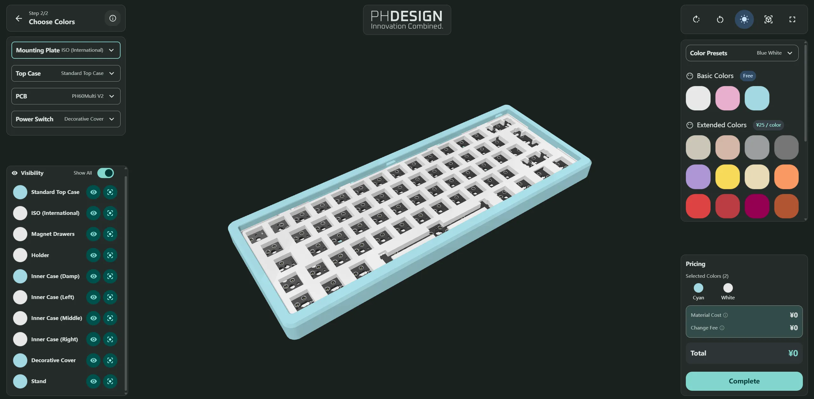
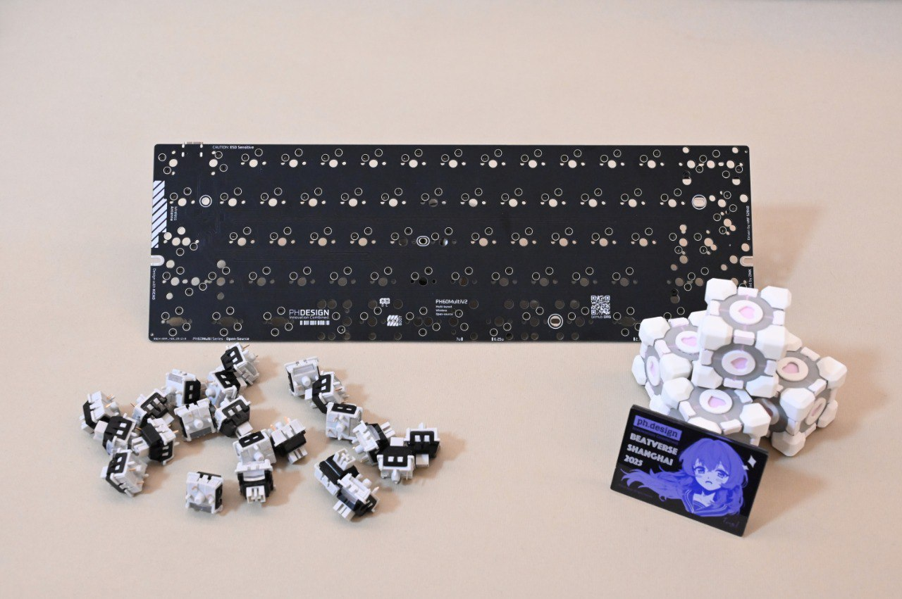

# <b>⚠️Warning⚠️</b>
<b>You are currently on the dev branch, which contains the latest project progress but may include unstable or unfinished features and code. It is recommended to switch to the production branch; the latest production version is: <a href="https://github.com/ph-design/PH60/tree/Rev.2"><code>Rev.2</code></a>
</b>

[中文](README-zh_CN.md) | English

---

**More at [GitHub Repo](https://github.com/ph-design/PH60) | [Discord](https://discord.gg/8UfQXcefPH) | [Taobao Store](https://shop268559013.taobao.com) | [QQ Group]([https://your-qq-group-link](https://qm.qq.com/q/oTGGu0rjs6)) | [Customization Tool](https://custom.phdesign.cc)**

---

# Introduction

**PH60 Revision 3** is a 60% mechanical keyboard kit that includes a set of FDM 3D-printable case parts and the **PH60W** tri-mode PCB. In this revision we reworked many key designs from the previous version with wireless and universality as goals; added support for multiple battery and magnet sizes; reduced the number of non-printed parts; and significantly optimized material usage and print time for FDM 3D printing.

## Features

+ 🎯 Case designed for FDM 3D printing — printable on any 3D printer with a bed larger than 256 mm × 256 mm, no supports required.
+ 🏠 Family-style magnetic quick-release latch system for easy disassembly and maintenance of any keyboard component.
+ ✊ Unique O-ring gasket plate design providing a firm, crisp typing feel without any infill.
+ 📦 Modular installation design supporting up to 100 × 50 × 5 mm LiPo battery packs and 10 × 5 × 5 mm magnets.
+ 🔒 Locking holder for wireless receivers compatible with most commercial 2.4 GHz receiver housings.
+ 🛜 Third-generation **PH60W** tri-mode PCB supporting USB‑C, Bluetooth 5.3, and 2.4 GHz.
+ 💻 Powered by the [Raspberry Pi RP2040](https://www.raspberrypi.com/products/rp2040/) microcontroller.
+ 💖 Supports open-source [QMK firmware](https://qmk.fm/) and [VIA configuration](https://www.caniusevia.com/) (via JSON).
+ ♻️ Ongoing updates to plate designs for popular layouts such as ANSI, ISO, and HHKB.

## Customization

Use our [web-base tool](https://custom.phdesign.cc) to customize your own PH60R3 experience with live 3D preview.

## PH60 Multi V2 PCB

In our [official Taobao store](https://shop268559013.taobao.com) purchase the PH60 Multi V2 PCB for a perfect compatibility experience with the PH60 Rev3 case.

## Printing Guide

PH60 Rev3 case is designed for FDM 3D printing and prints well with default printer settings. For best strength and surface quality, consider the following recommended settings:

| Setting | Recommended | Notes |
| --- | --- | --- |
| Filament | PLA or PETG | High‑temperature materials increase warp risk |
| Layer height | 0.2 mm | Model designed around 0.2 mm |
| Wall count | 2 walls | --- |
| Infill pattern | Gyroid/Spiral | --- |
| Infill density | 15% | --- |
| Wall generator | Arachne | Improves print speed |
| Accurate outer wall | Enabled | Reduces visible layer lines |
| Support | Off | Designed to print without supports |

Before printing, ensure the build plate is leveled and clean. Use adhesive aids for long thin parts (e.g., top cover) to prevent warping. After printing, post-processing like sanding and cleaning is recommended to improve finish and feel.

## Assembly

| Item | Quantity | Notes |
| --- | --- | --- |
| 3D printed case parts | 1 set | Recommend PLA or PETG |
| PH60W tri-mode PCB | 1 | Includes pre‑soldered SMD components |
| Mechanical switches | 61 (ANSI) | MX‑style compatible switches |
| Keycaps | 1 set | Compatible with 60% layout |
| 2.4 GHz wireless receiver (optional) | 1 | --- |
| LiPo battery pack (optional) | 1 | Recommended: 100 × 50 × 5 mm, Molex 1.25 mm connector |
| Magnets | 8 | Recommended: 10 × 5 × 3 mm, N52 |
| Silicone O-rings | 8 | Outer dia. 9 mm, cord dia. 1.5 mm |
| Silicone anti-slip pads | 4 | Recommended: 20 × 10 × 2 mm |

Refer to the assembly video tutorials for step-by-step guidance.

## FAQs

### 1. Where are the Rev3 case models?
The Rev3 case models are in the dev branch under the [Case_Model_Rev3](Case_Model_Rev3/) directory. Plate files are inside the `/Plate` folder within that directory. Download and print the models as needed.

### 2. Which 3D printers can print the Rev3 case?
PH60 Rev3 case is designed for most FDM 3D printers. If your printer bed is larger than 256 × 256 mm and can print PLA or PETG, you should be able to print the case.

### 3. Which layouts does the Rev3 case support?
PH60 Rev3 supports multiple 60% layouts including ANSI, ISO, and HHKB, as well as an ANSI-capable plate designed for EC60 PCB with NIZ housings for electrostatic capacitive switches. Plate designs will be continuously updated to support more popular layouts.

### 4. Which tri-mode PCBs is the Rev3 case compatible with?
The Rev3 case is primarily designed for compatibility with the PH60W tri-mode PCB. Because dimensions and power connector positions can vary between boards, please consult our compatibility list or contact us before purchasing other third‑party PCBs.

### 5. What battery and magnet sizes are supported?
The Rev3 case supports up to a 100 × 50 × 5 mm LiPo battery pack. You can modify the battery tray and magnet drawers to fit other sizes; the provided dimensions are recommended and easy to source.