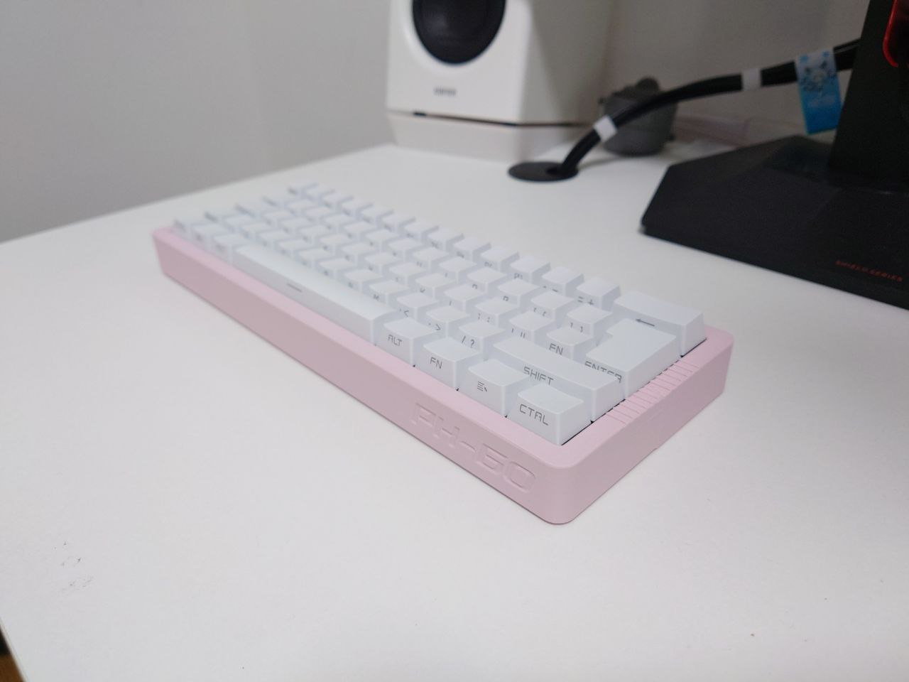

English Version | [中文](https://github.com/ph-design/PH60/blob/Rev.1/README-zh_CN.md)

---

# PH60 Rev.1




An ISO 60% layout mechanical keyboard Based on the ISO/IEC 9995 standard.

View our keyboard on Youtube & bilibili! (No english subtitle)

bilibili: https://www.bilibili.com/video/BV19Txce7E6C/

YouTube: https://www.youtube.com/watch?v=n_Wk9k1vW7k

## Project Structure
```
PH60
├── LICENSE                         # Project license file
├── PCB_Daughterboard_Model         # Daughterboard 3D model files
├── PCB_Daughterboard_Rev_SuperEZ   # Daughterboard PCB design files
├── PCB_Model_Rev1                  # Main PCB 3D model files
├── PCB_Rev1                        # Main PCB design files
├── Preview                         # Pic of the keyboard preview
├── Production                      # Production files
├── README-zh_CN.md                 # Chinese README
├── README.md                       # English README
└── case_model                      # Keyboard case 3D model files
```

The daughterboard is from [UDB-S](github.com/Unified-Daughterboard/UDB-S). ESD protection and some other features have been removed to reduce size and verification costs. If you require higher electrical performance, please refer to the original project for modifications.

## Specifications

1. Fully 3D-printed case that can be printed on any 3D printer with a build plate larger than 250mm x 250mm.
2. Gasket mount structure for a soft and flexible typing experience.
3. Powered by [Raspberry Pi RP2040](https://www.raspberrypi.com/products/rp2040/) microcontroller.
4. Supports open-source [QMK firmware](https://qmk.fm/) and [VIA configuration](https://www.caniusevia.com/) (via JSON configuration).
5. Optional daughterboard for flexible USB-C port placement.

## Assembly Instructions

1. Print all components. The plate should be divided into two parts for printing. Alternatively, consider using FR-4 or other materials.
2. Align the two upper cover rails and press them firmly until the surfaces are flush.
3. Install the bottom case sides using the same method.
4. Apply Poron foam to both edges of the PCB.
5. Place the daughterboard into the central clip and secure it. Open the Molex connector cover, insert the FFC cable, then close the cover (optional).
6. Insert several switches around the corners and center of the plate. Flip the plate over and press the PCB firmly against it. Ensure switch pins are correctly inserted into the hotswap sockets to avoid bending.
7. Install all stabilizers and perform an initial PCB test.
8. Install the remaining switches.
9. Connect the FFC cable to the PCB.
10. Place the plate and PCB into the bottom case. Hook the front edge of the upper cover into the groove of the bottom case on the user-facing side, then press down on the other side of the upper cover until it's flush with the bottom.
11. Lock the clips in place.
12. Install the keycaps.

## Caution

If hand-soldering the PCB, avoid using Sn42Bi58 low-temperature solder paste. This can cause loose connections between the PCB and hotswap sockets under heavy usage.